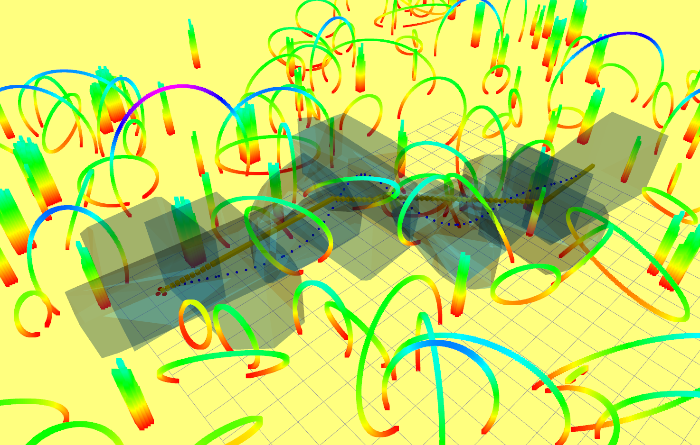

# DIRECT: a DIffeREntial dynamiC programming based framework for Trajectory generation

**Video Links:** [Video1](https://youtu.be/BM8_ABM_2VM)

**Authors:** Kun Cao, Muqing Cao, Shenghai Yuan, Lihua Xie.

**Related Paper**

* [**DIRECT: A Differential Dynamic Programming Based Framework for Trajectory Generation**](https://ieeexplore.ieee.org/document/9681227), Kun Cao, Muqing Cao, Shenghai Yuan, Lihua Xie, IEEE RA-L, 2022.


*If you use DIRECT for your application or research, please star this repo and cite our related paper.* [bib](bib.txt)

## Prerequisites
Our trajectory planning module is built on top of the [Teach-Repeat-Replan](https://github.com/HKUST-Aerial-Robotics/Teach-Repeat-Replan) package, and has been tested in ROS Melodic (Ubuntu 18.04) and Kinetic (Ubuntu 16.04).
For setup and installations, please follow the instructions in [Teach-Repeat-Replan](https://github.com/HKUST-Aerial-Robotics/Teach-Repeat-Replan) and make sure you can run their test scripts first.

Then, create a new workspace and clone this package:

```bash
cd ~/ && mkdir catkin_ws_direct && cd catkin_ws_direct && mkdir src && cd src
git clone https://github.com/ntu-caokun/DIRECT.git
cd cd ~/catkin_ws_direct && catkin_make
```
 
## Running Simulations
To launch a simple demo:
```
cd ~/ && bash src/DIRECT/simulation.sh
```

The ddp optimizer will solve for a trajectory when you click a target point in the RVIZ display:



## Acknowledgements
We use the simulation environment and utilities of [Teach-Repeat-Replan](https://github.com/HKUST-Aerial-Robotics/Teach-Repeat-Replan).
